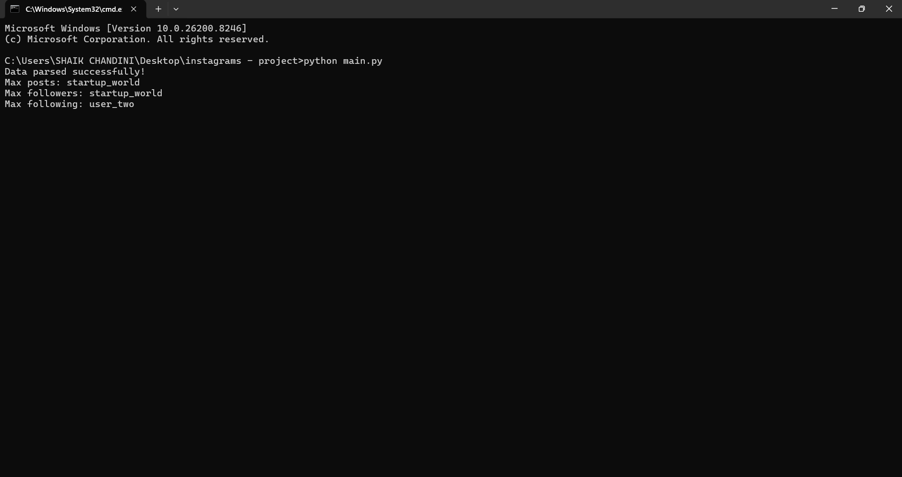
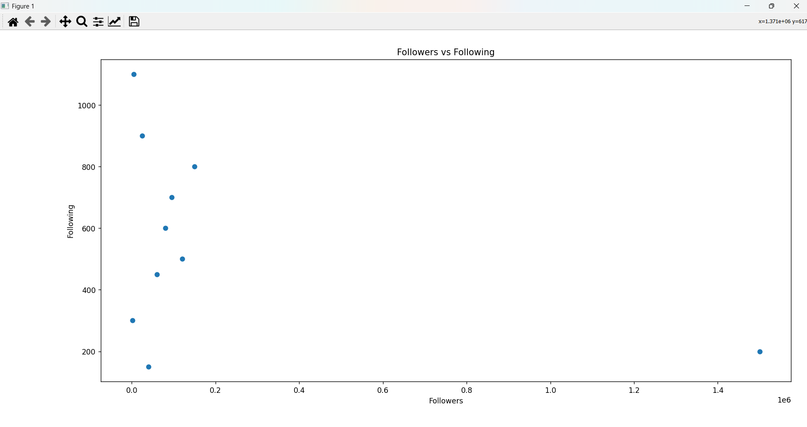
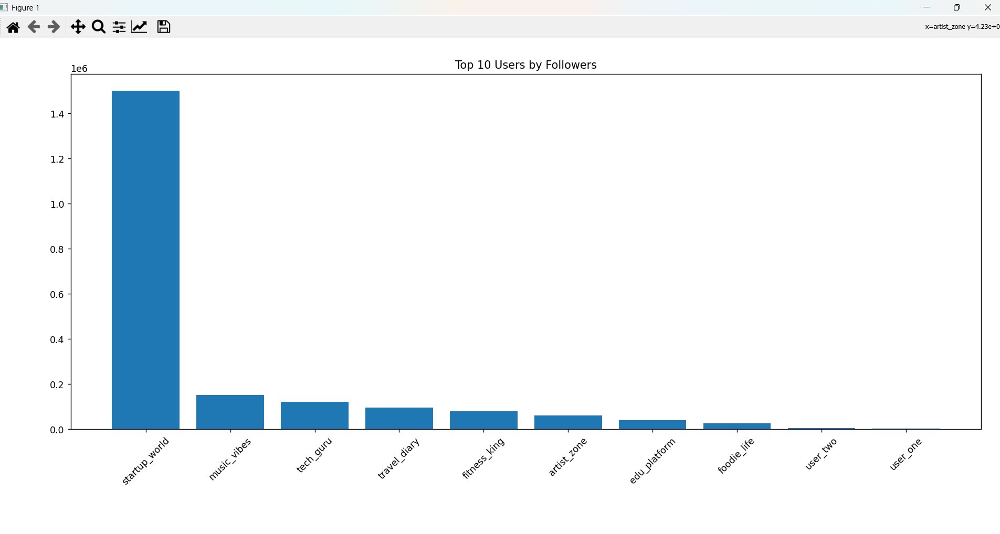
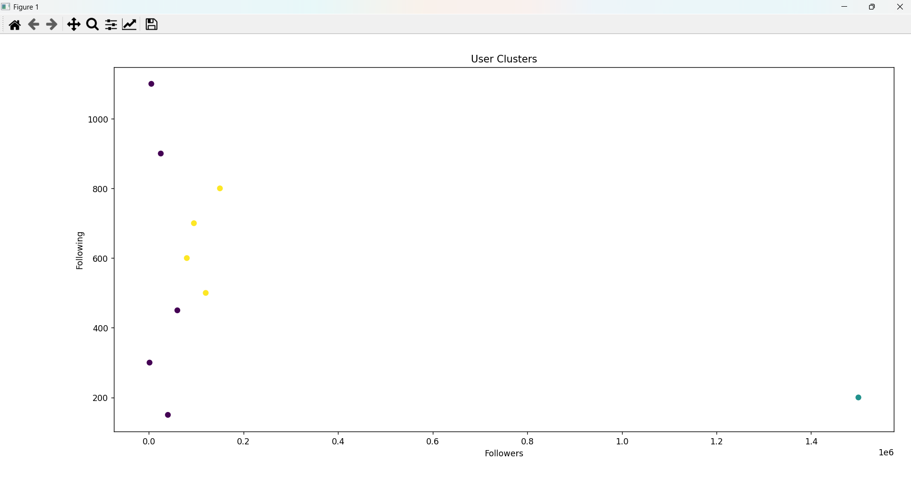

# 📊 Instagram Data Analysis: Bangalore Developer Community

## 🧠 Overview
This project focuses on analyzing Instagram-style user data using Python. It extracts structured insights from raw data, identifies top-performing users, and visualizes engagement patterns such as posts, followers, and following relationships. The project also includes basic clustering to group similar users.

---

## 🎯 Objective
- Convert unstructured Instagram-like data into structured format  
- Analyze user engagement metrics  
- Identify top influencers in the dataset  
- Visualize trends using graphs  
- Perform basic user clustering using KMeans  

---

## 🚀 Features
- Data parsing and cleaning from raw dataset  
- Extraction of user statistics (posts, followers, following)  
- Identification of top users based on engagement  
- Data visualization using Matplotlib  
- User clustering using KMeans algorithm  
- Conversion of raw data into structured JSON format  

---

## 🛠 Tech Stack
- Python  
- Pandas  
- Matplotlib  
- Scikit-learn  
- NumPy  

---

## ⚙️ Project Workflow
- Load raw Instagram-like dataset  
- Clean and structure the data  
- Extract user attributes  
- Perform analysis on posts, followers, and following  
- Generate visualizations  
- Apply KMeans clustering on users  

---

## 📊 Key Insights
- Users with highest posts identified  
- Users with maximum followers identified  
- Users with highest following identified  
- Clear distribution of engagement across users  
- User clusters formed based on activity levels  

---

## 📈 Visualizations

### 🔹 Output Example


### 🔹 Followers Distribution


### 🔹 Posts Analysis (Bar Graph)


### 🔹 User Clustering (KMeans)


---

## ▶️ How to Run
```bash id="runfix99"
pip install -r requirements.txt
python main.py
---

## ⭐ Project Outcome
- Data preprocessing  
- Exploratory Data Analysis (EDA)  
- Data visualization  
- Machine learning clustering  
- Real-world dataset handling  

---

## 👩‍💻 Author
**Shaik Chandini**  
